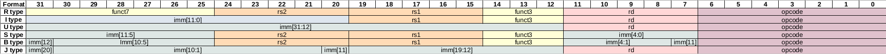

## Decoding RIMI-specific instructions

Some experiments can be found in this [Gigue fork](https://github.com/pcotret/gigue):

```bash
$ python test_instruction_rimi.py 
Decoding instruction lb1
Type I
?????????????????000?????0011111
Instruction length: 32

Decoding instruction lbu1
Type I
?????????????????100?????0011111
Instruction length: 32

Decoding instruction lh1
Type I
?????????????????001?????0011111
Instruction length: 32

Decoding instruction lhu1
Type I
?????????????????101?????0011111
Instruction length: 32

Decoding instruction lw1
Type I
?????????????????010?????0011111
Instruction length: 32

Decoding instruction lwu1
Type I
?????????????????110?????0011111
Instruction length: 32

Decoding instruction ld1
Type I
?????????????????011?????0011111
Instruction length: 32

Decoding instruction sb1
Type S
?????????????????000?????0111111
Instruction length: 32

Decoding instruction sh1
Type S
?????????????????001?????0111111
Instruction length: 32

Decoding instruction sw1
Type S
?????????????????010?????0111111
Instruction length: 32

Decoding instruction sd1
Type S
?????????????????011?????0111111
Instruction length: 32

Decoding instruction chdom
Type I
?????????????????000?????1110111
Instruction length: 32

Decoding instruction retdom
Type I
?????????????????000?????1111111
Instruction length: 32

Decoding instruction ss
Type S
?????????????????111?????0111111
Instruction length: 32

Decoding instruction ls
Type I
?????????????????111?????0011111
Instruction length: 32

```
